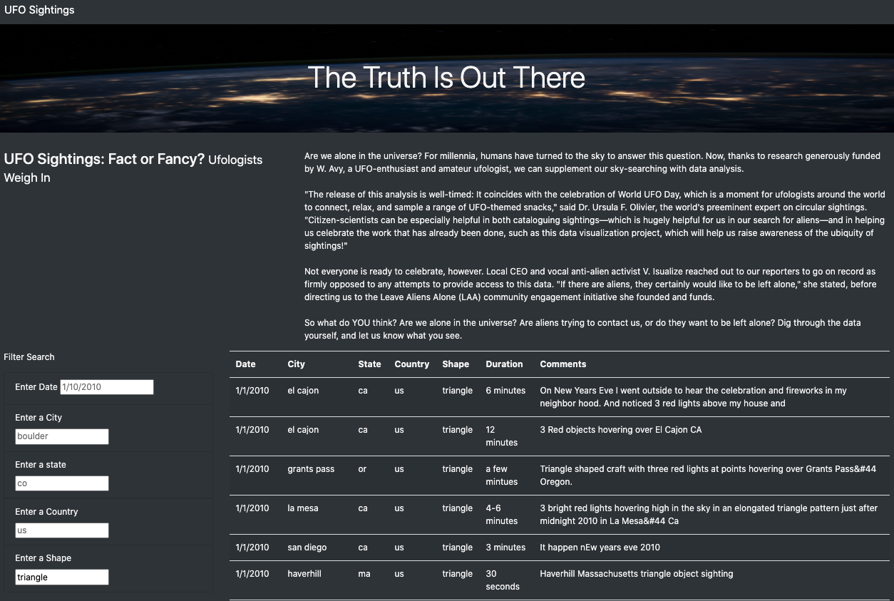
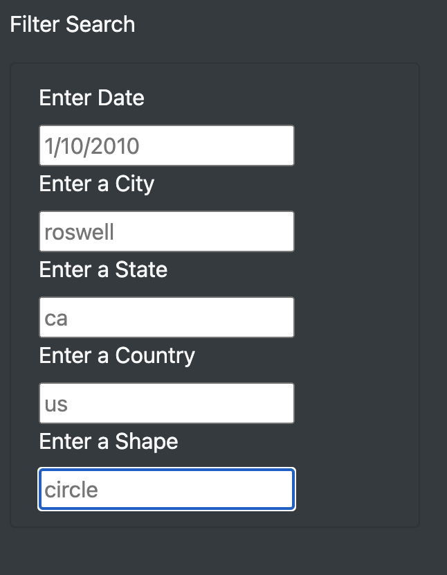
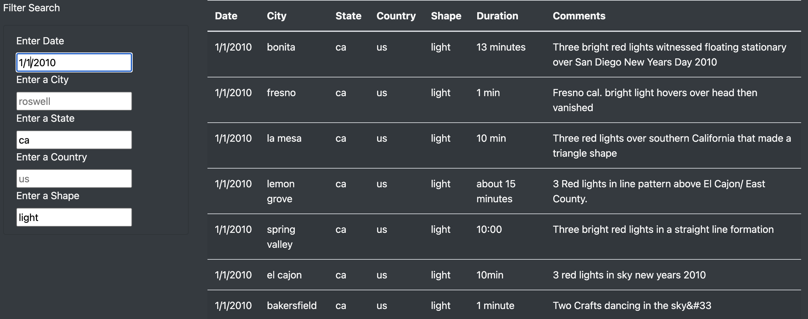
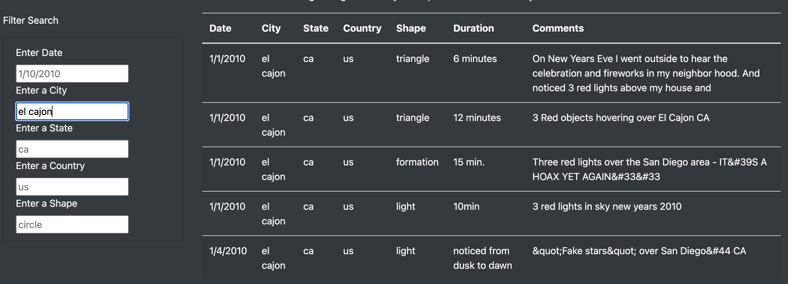
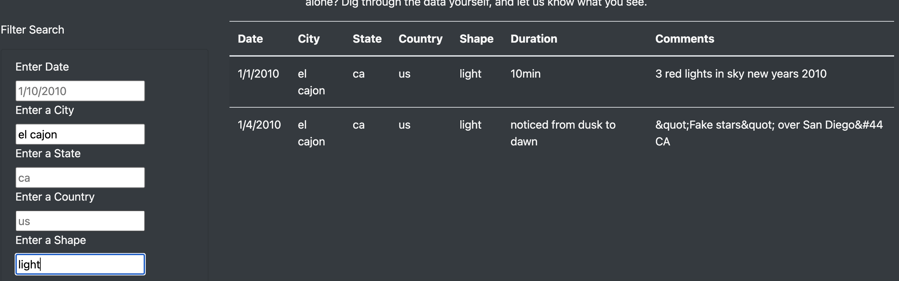

# UFOs

## Project Overview

The purpose of this this project is to help Dana in creating a webpage using HTML and Javascript visualize and organize the reported sightings in an interactice manner. To enable users, to access data of reported sightings in each city or time they choose. We used the CSS to design the page to make it more appealing and enagaging to the users.

## Results
The first view of the UFO webpage is displayed as below:
    

You can also observe there is a filter search engine:
    

You can filter the search to each criteria you desire. This is image below shows the result of the filtered when the criteira has been set as the following: 1/1/2010 as the date, ca as the state, light as the shape.

                 
                 
This following image shows the he result of the filtered when the criteira has been set as the following: el cajon as city.
                 

This following image shows the he result of the filtered when the criteira has been set as the following: el cajon as city and light as shape.

                
## Summary
- The search field is "case-sensitive". The table will not update unless you enter the search criteria exactly how the data is stored. Partial entries would not work. 

- There is no button to click or wording that tells the user that the table will update after you hit "enter". 

- The data is limited and outdated since it is not linked to a "live" source.

## Resources
- Software: Javascript, Visual Studio Code, CSS, HTML
